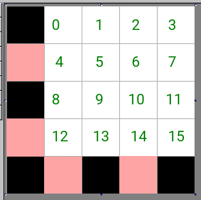

# a3x5-variable

The ultimate tiny raster font.

This font is designed for use in situations where text must be displayed in a grid of pixels extremely limited in resolution and density. It aims to be as legible as possible.

## Characteristics

 * Variable-width letters; monospace Arabic numerals
 * No ascenders or descenders: all characters fit between baseline and x-height
 * No intentionally decorative features
 * Character Size:
   * Width: 3 - 5 pixels, depending on character complexity
   * Height: 5 pixels

## Character Set

Since the available canvas space is so limited, we can only implement so many characters. However, as this font is primarily meant to serve as the smallest available font on a scientific calculator, we can guarantee that there will be lots of mathematical symbols and Greek letters in the first release.

### Completeness

| Character Set              | Completeness |
| -------------------------- | ------------ |
| ASCII-7                    | 100%         |
| ASCII-8                    | 0%           |
| Greek letters              | 0%           |
| Mathematical symbols       | 0%           |

Take a look at [TODO.md](./TODO.md) for details.

### Handling of invisible control codes

The control code indicators (BEL, NUL, etc.) are too big to fit within a 5×5 space. So, when control characters need to be displayed, they are expressed as such:

* The red shaded area is always left white.
* The black area is always black to signify that the character contains a control code.
* The rest of the area will contain the 16 bits that denote which control code is represented. They are represented in big-endian order from top to bottom, left to right on each row.
  * The topmost row is bits 0~3, left to right
  * The row below the topmost is bits 4~7
  * The row above the lowest is bits 8~11
  * The bottom row is bits 12~15
* The correspondence between each bit pattern and each control code is specified in [CONTROLCODES.md](./CONTROLCODES.md)
* The extremely predictable nature of the control code characters makes it feasible to generate them at runtime. Therefore, the control code characters are not embedded in the font itself and will have to be rendered on the spot by the font renderer.

## Contributors

* twisted_nematic57
* fghsgh for her very insightful input and some contributions to the Greek letters

## Licensing

Public domain ;)
